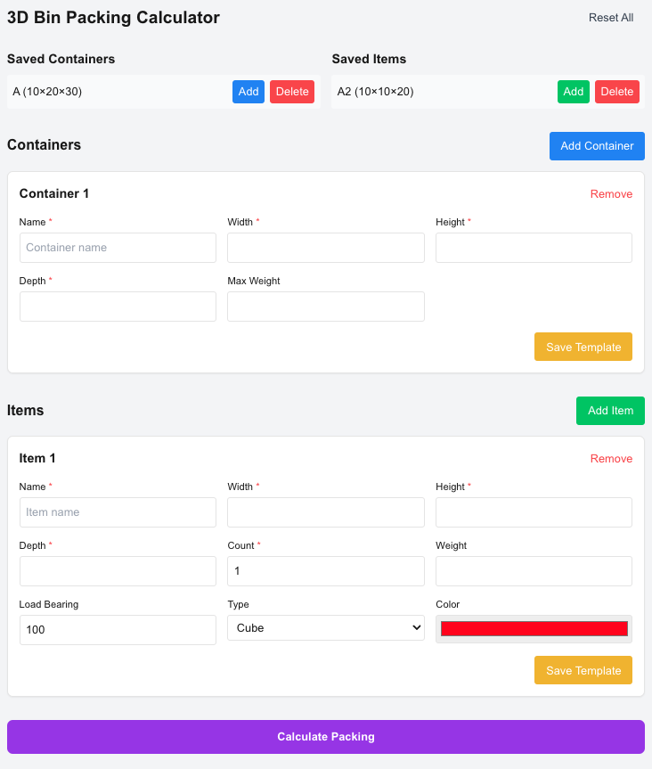
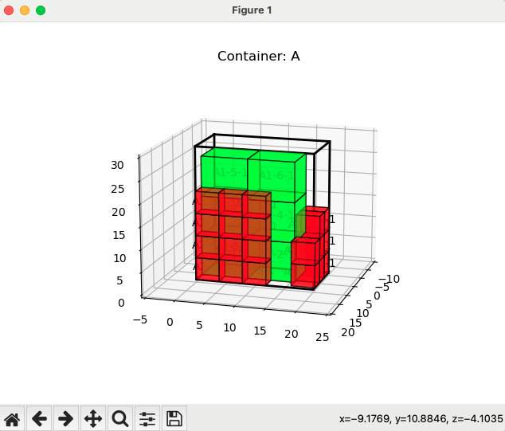
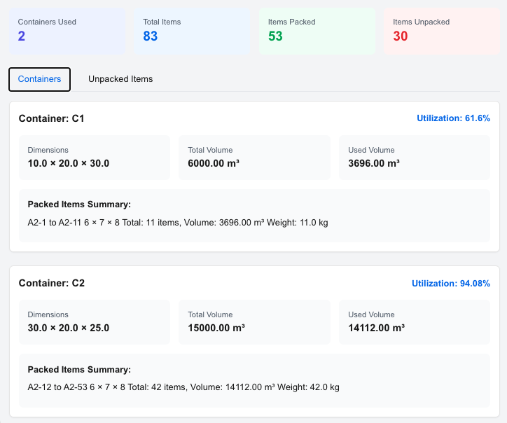
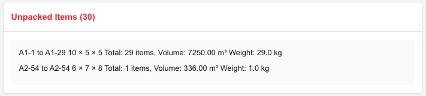

# 3D Bin Packing Visualization Tool

A React and Python based visualization tool for 3D bin packing algorithms, helping users calculate and optimize item placement in 3D space. Based on [jerry800416/3D-bin-packing](https://github.com/jerry800416/3D-bin-packing) and [enzoruiz/3dbinpacking](https://github.com/enzoruiz/3dbinpacking)

## Features

- Multiple container and item configuration support

- Real-time 3D visualization

- Save frequently used container and item templates

- Detailed packing reports and statistics

- Support for both cylindrical and cubic items

- Weight and load-bearing constraints

  

  

  

## Installation

### Prerequisites

- Python 3.6.5 or higher
- Node.js and npm

### Setup

1. Clone the repository
2. Install and setup the backend
```bash
# Create and activate virtual environment
python -m venv venv

# Windows
venv\Scripts\activate
# Linux/Mac
source venv/bin/activate

# Install backend dependencies
pip install -r requirements.txt
pip install fastapi uvicorn
```

3. Install frontend dependencies
```bash
cd bin-packing-app
npm install
```

## Usage

1. Start the backend server
```bash
# From the root directory
python pack.py
```

2. Start the frontend development server
```bash
# In another terminal, from the bin-packing-app directory
npm run dev
```

3. Open your browser and navigate to `http://localhost:3000`

## Acknowledgments

This project uses the [3D-bin-packing](https://github.com/jerry800416/3D-bin-packing) library by jerry800416 for core packing algorithms.

## License

MIT License
